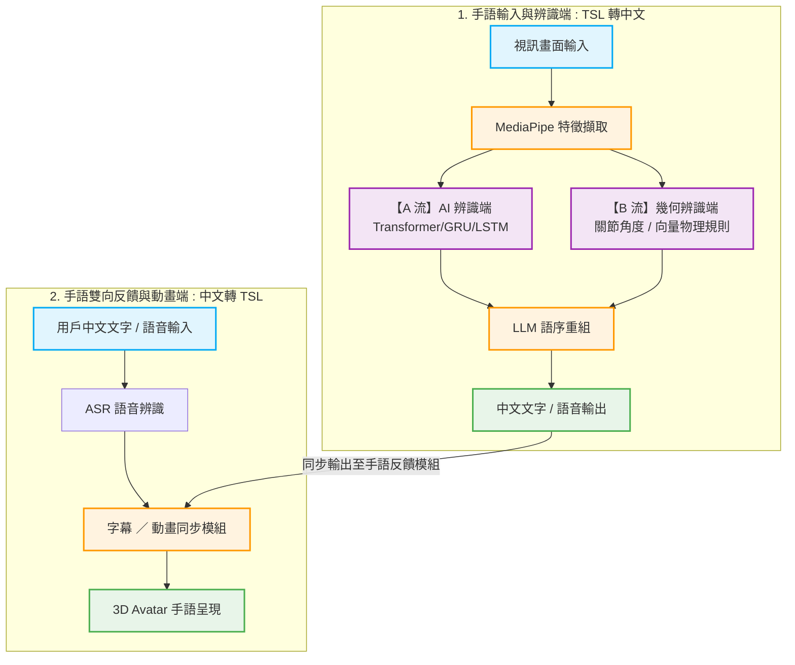

# sign-pipeline-design


### 🎬[三下期末報告影片](https://drive.google.com/file/d/1GofrD0zfCPDhS8rKh7rqyqgFy-iRNPvg/view?usp=sharing)


本系統旨在提供**台灣手語 (TSL)** 與**中文（文字/語音）**之間的即時雙向翻譯，促進聽障人士與一般人士在日常生活中的溝通。

> 📢 **專案開發階段聲明**：本專案目前處於**分模態核心開發與實驗階段**。各核心模組（雙流辨識演算法、LLM 語意轉換、3D 動畫生成）正同步進行獨立算法驗證與測試，後續將透過 WebSocket / API 進行全系統串接整合。

---

## 📌 系統簡介與開發背景

### 開發背景
現有溝通工具多依賴文字輸入或視訊聯繫，對於以手語為母語的聽障族群而言，轉換至文字邏輯仍存在思維門檻。目前市面上的手語辨識多針對美國手語 (ASL)，台灣手語 (TSL) 的即時翻譯工具相對匱乏。此外，手語的語法結構（如語序倒裝、表情配合）與口語中文存在顯著差異，需要更深層的語意轉換機制。

### 開發動機
本專案的核心動機在於開發一個屬於台灣本土的雙向翻譯平台，讓手語使用者能以熟悉的肢體語言表達，同時讓不具備手語能力的聽人能透過語音或文字無障礙地理解對方的意思，進而提升醫療、櫃台服務及日常生活的互動品質。

### 系統特色與創新性
* **🔄 即時雙向翻譯（規劃中）**：支援「手語錄入轉文字/語音」與「文字/語音輸入轉手語」雙向並行。
* **🧠 創新「雙流手勢辨識機制」（核心開發中）**：為了兼顧辨識的泛化能力與精準度，系統整合了兩大辨識主流：
  * **【A 流】AI 深度學習辨識**：利用時序模型學習複雜的手語句型與上下文語意。
  * **【B 流】幾何特徵規則辨識**：透過計算手指關節角度、空間向量與相對距離等物理幾何特徵，針對關鍵單詞進行精準的物理校正。
* **🙌 多模態特徵整合**：利用 MediaPipe Holistic 擷取手部（21 點骨架）、臉部表情（口型、眉毛）與全身姿態資料，提供雙流辨識模組足夠的特徵基底。
* **🤖 擬真 3D 視覺化（動作庫建立中）**：使用 Blender 進行骨架綁定，並預計透過 Three.js 於網頁端驅動 3D 虛擬角色（Avatar）呈現手語。

---

## 🏗️ 系統架構與設計藍圖 (System Architecture)

本系統採獨立模組化並行開發。後端採用 **AI 與幾何特徵雙軌並流（Dual-stream）** 的辨識機制，並導入 **LLM（大型語言模型）** 進行精準的台灣手語與中文語序重組，實現流暢的雙向閉環（Closed-loop）互動：



### 各模組功能與現階段分工說明

1. **使用者介面層（Web 前端 UI 草案）**
   * **功能描述**：提供網頁端視訊畫面、翻譯結果顯示區，並內嵌 Three.js 3D 虛擬角色。
   * **開發技術**：HTML5、CSS3、JavaScript、Three.js。

2. **MediaPipe 特徵擷取模組**
   * **功能描述**：利用 `MediaPipe Holistic` 追蹤並擷取手部 21 點骨架、臉部表情與全身姿態，將其序列化為 JSON 格式之時序關鍵點資料，作為後端雙流辨識的共同底數據。
   * **開發技術**：Python、OpenCV、MediaPipe。

3. **手語辨識模組 —【A 流：AI 深度學習】**
   * **功能描述**：接收特徵點的時序資料，經由深度學習模型進行複雜句型與語意上下文的特徵識別，輸出初步的手語詞彙（Gloss）。
   * **開發技術**：PyTorch、Transformer / GRU 模型。

4. **手語辨識模組 —【B 流：幾何特徵規則】**
   * **功能描述**：直接計算手指關節間的角度、空間向量與相對距離，利用 Rule-based（基於規則）的物理演算法進行特定關鍵單詞的精準物理校正與補強。
   * **開發技術**：Python、NumPy（幾何向量計算）。

5. **大型語言模型語意重組引擎（LLM Engine）**
   * **功能描述**：利用 LLM 強大的自然語言理解能力，將 A/B 雙流辨識出的手語詞彙（Gloss），依據台灣手語文法進行語序倒裝調整與潤飾，轉譯為符合自然中文文法的語句輸出。
   * **開發技術**：LLM API 串接、Prompt Tuning。

6. **3D 手語動畫生成與字幕同步模組**
   * **功能描述**：在 Blender 中完成 3D 角色骨架綁定（Armature Rig）與手語動作 Keyframe 片段製作。本模組具備**雙軌驅動能力**：除了能接收外部輸入的中文轉為手語外，也能將系統辨識完經 LLM 重組後的中文再次轉為手語動畫，供聽障使用者進行**即時雙向反饋驗證**。
   * **開發技術**：Blender（動作庫製作）、Three.js（網頁端動態 Clip 組合播放與字幕控制器）。

## 📂 專案目錄結構 (Project Structure)

目前專案目錄依據組員功能分工進行切分，各組員於對應資料夾下進行獨立開發、資料收集與演算法實驗，以便於未來進行模組化串接：
```
sign-pipeline-design/
├── 使用案例圖/            #📂 系統功能邊界分析與權限分組圖檔
│   ├── 使用案例1.pdf                
│   ├── 使用案例2.pdf        
│   ├── 使用案例3.pdf        
│   ├── 使用案例4.pdf    
│   │
│   ├── 使用案例描述/       # 📂 核心功能之正常與例外情節規格書          
│   ├── 核心使用案例一.pdf
│   ├── 核心使用案例一.pdf      
│   ├── 核心使用案例一.pdf  
│   └── 核心使用案例一.pdf    
├── 活動圖.pdf             # 🔄 手語翻譯管線動態行為與並行運算流程圖
├── 類別圖.pdf             # ⚙️ 靜態模組物件關係與資料傳遞架構圖
├── 詞彙表.pdf             # 📘 跨領域核心術語與邊界定義規格書
└── README.md
```
## 📝 儲存庫文件內容技術解釋 (Specification Guide)

以下針對本儲存庫內各項 UML 設計文件的核心技術內涵與重要性進行深度解釋：

### 📘 1. 詞彙表 (Glossary.pdf)
為了確保跨領域開發（資工演算法、AI 深度學習、手語語言學）在對接時的規格一致性，本文件首要界定了系統核心術語之技術與語意邊界。
* **文件解釋重點**：
  * **語言文法解耦**：明確區分了「台灣手語 (TSL)」與「手語單字 (Gloss)」之文法差異，為 LLM 語意引擎提供重組基礎。
  * **雙流決策定義**：定義後端整合中心在進行「A 流 AI 機率分佈」與「B 流專家幾何規則匹配」時的權重加權融合演算法。
  * **斷句機制動態定義**：詳細記錄系統如何利用「智慧中斷點 (Debounce)」在雙手離開畫面或動作停滯滿 2.0 秒時，自動觸發連續手語串流的精準斷句機制。

### 🧱 2. 使用案例圖與使用案例描述 (Use Case Diagrams & Specifications)
透過物件導向分析（OOA），清晰勾勒出翻譯系統的功能範疇、系統主客體邊界與參與者權限分組。
* **使用案例圖解釋**：系統揚棄了傳統教科書冗餘的過渡節點，將使用者精密劃分為 **【一般使用者 (聽人)】**、**【手語使用者】** 與 **【非手語使用者】** 三大具體人類角色，分別拉線直接對接「手語即時翻譯」與「文字轉手語動畫」等核心功能模組。同時，將「雲端 Gemini API」定義為外部次要服務參與者（Service Actor）。
* **使用案例描述解釋**：針對核心功能進行嚴密的行為規格撰寫，包含：
  * **正常事件流情節**：詳細記錄系統在理想狀態下（Webcam 擷取 $\rightarrow$ 雙流辨識 $\rightarrow$ 語意重組 $\rightarrow$ 字幕與動畫雙軌呈現）的標準運作流程。
  * **例外處理情節**：高度穩健的 QoS 機制設計，詳細定義了當環境發生「肩膀/手腕基準點缺失提示」時的視覺化補正提示，以及「雲端 API 網路中斷時自動觸發之三級容錯轉移 (Failover Routing)」備援機制，確保系統永不崩潰。

### 🔄 3. 活動圖 (Activity Flow.pdf)
以嚴密的動態行為圖（UML Activity Diagram）具現化即時影像串流從鏡頭輸入到翻譯反饋的完整生命週期。
* **文件解釋重點**：
  * **跨平台職責隔離**：圖表採用垂直泳道（Swimlanes）將「使用者、前端網頁UI、後端核心運算層、雲端服務大腦」四大主體的執行邊界清晰劃分。
  * **A/B 雙流並行運算（Fork/Join）**：圖中最核心的技術點在於使用標準的 **Fork/Join 粗黑線符號**，實作了 A 流（時序特徵學習）與 B 流（幾何特徵物理规则）的非同步平行運算與整合中心融合流程。
  * **雜訊回歸控制**：在各個條件判斷分支引入 `detach` 語意，使無效的日常雜訊動作就地過濾並重新回到影像擷取迴圈，保障翻譯主幹道管線的高效能與低延遲。

### ⚙️ 4. 類別圖 (Class Architecture.pdf)
定義本系統後端整合之靜態高層次結構，體現「低耦合、高凝聚」的軟體架構設計原則。
* **文件解釋重點**：
  * **靜態結構藍圖**：完整定義了前端 UI 聯動、MediaPipe 特徵擷取器、A流時序處理器、B流幾何引擎、融合中樞以及雲端大腦 Worker 之間的類別依賴與包含關係（Association & Dependency）。
  * **介面資料傳遞規格**：清楚梳理了 3D 拓樸座標、時序張量（Tensors）與非同步語意佇列（Gloss Queue）在各類別方法（Methods）與屬性（Properties）之間的資料格式與傳遞規範，為未來系統進行 WebSocket / API 串接與軟硬體整合時提供唯一的技術底層藍圖。

## ⚙️ 系統預期非功能性需求 (QoS 目標)
在未來的系統整合階段，本團隊將以以下指標作為非功能性規格之優化目標：

⚡ 效能與低延遲：整體雙向翻譯運算延遲（Latency）控制在 2~3 秒 內；3D 動畫渲染幀率需穩定維持在 30 FPS 以上，以確保手語動作流暢、清晰可辨。

🔒 隱私與安全性：系統運作期間擷取之使用者影像，僅用於即時特徵點提取，伺服器端不得永久儲存任何原始視訊檔案與隱私畫面，以符合個資保護原則。

♿ 可用性設計：考量聽障人士需求，使用者介面（UI）需具備清晰的文字顯示區，且在辨識失敗或環境光線不足時，提供視覺化的狀態提示。

🧩 擴充性需求：手語動作資料庫與語意分析模組採模組化解耦設計，以利未來新增手語詞彙或支援其他語系。

## 🎯預計貢獻
1. 強化日常溝通自主性：提升聽障者在日常社交、門診醫療或臨櫃服務等公共情境中的即時溝通能力，減少對同步手語翻譯員的依賴。

2. 完備雙向翻譯技術鏈：整合「手語辨識」與「動畫生成」技術，補足現有工具多為單向轉換的不足，實現真正的對等溝通。

3. 建立本土手語 AI 技術基礎：針對台灣手語（TSL）建立標準化的資料處理流程、關鍵點特徵抽取標準與模型訓練策略，為未來 TSL NLP 與相關 AI 應用提供可靠的技術架構。

4. 推動科技助殘與社會共融：透過技術手段消除溝通門檻，提升多樣化服務情境下的友善度與品質。

## 👥 開發團隊與分工 (Authors)
李宜穎 — 負責 A 流 AI 深度學習辨識端設計，包含 LSTM / GRU / Transformer 模型架構搭建、資料預處理與時序詞彙量擴大。

周語旋 — 負責 B 流（幾何特徵規則辨識演算法研發）與後端 LLM 大型語言模型語意重組引擎整合。

吳珮甄 — 負責 3D 動畫組：Blender 3D 虛擬角色（Avatar）骨架綁定、手語動作 Keyframe 動作庫建立。

尹品臻 — 負責 使用者介面層（Web 前端 UI 設計、版面配置與前端視覺化草案規劃）。
